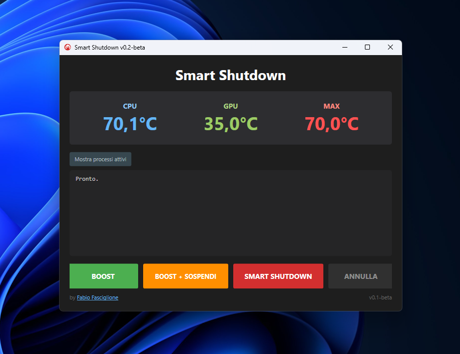

# Smart Shutdown

**Utility intelligente per Windows** che monitora le temperature hardware (CPU/GPU) e gestisce lo spegnimento automatico del PC quando le temperature si stabilizzano.

Ideale per chi lascia il PC acceso durante rendering, encoding, o altre operazioni intensive e vuole che si spenga automaticamente quando ha finito.

## Funzionalit&agrave;

- **Smart Shutdown** - Chiude i processi non critici, attende la stabilizzazione delle temperature, poi spegne il PC
- **Boost** - Chiude i processi per liberare memoria senza spegnere
- **Boost + Sospendi** - Chiude i processi e mette il PC in sospensione
- **Monitor Risorse** - Mostra i processi che consumano pi&ugrave; CPU e RAM

## Requisiti

- Windows 10/11 (x64)
- Privilegi di Amministratore (richiesti automaticamente)

## Download

Scarica l'ultima versione dalla sezione [**Releases**](https://github.com/fabiofasc/SmartShutdown-releases/releases).

1. Scarica il file `SmartShutdown-v0.2-beta-win-x64.zip`
2. Estrai il contenuto
3. Avvia `SmartShutdown.exe`

> L'app richieder&agrave; automaticamente i privilegi di amministratore (necessari per leggere i sensori hardware).

### Avviso Windows Defender

Windows Defender potrebbe segnalare l'eseguibile come minaccia. Si tratta di un **falso positivo** causato dalla libreria [LibreHardwareMonitorLib](https://github.com/LibreHardwareMonitor/LibreHardwareMonitor) che utilizza un driver kernel (`WinRing0`) per accedere ai sensori hardware. Questo comportamento &egrave; comune a tutti i software di monitoraggio hardware (HWiNFO, Open Hardware Monitor, ecc.).

Per risolvere:
1. In **Sicurezza di Windows** &rarr; **Protezione da virus e minacce** &rarr; **Cronologia protezione**
2. Trovare la minaccia segnalata e selezionare **Consenti nel dispositivo**

Oppure aggiungere un'esclusione:
1. **Sicurezza di Windows** &rarr; **Protezione da virus e minacce** &rarr; **Impostazioni** &rarr; **Gestisci impostazioni**
2. Scorrere fino a **Esclusioni** &rarr; **Aggiungi esclusione** &rarr; selezionare la cartella di SmartShutdown

Il codice sorgente &egrave; open source e verificabile.

## Screenshot

## Hardware Supportato

- **CPU**: Intel e AMD (testato su AMD Ryzen 9 7950X)
- **GPU**: NVIDIA e AMD (testato su AMD RX 6700 XT)

## Autore

**Fabio Fasciglione** - [fabiofasciglione.it](http://fabiofasciglione.it)

## Licenza

Questo progetto &egrave; distribuito sotto licenza [MIT](LICENSE).
